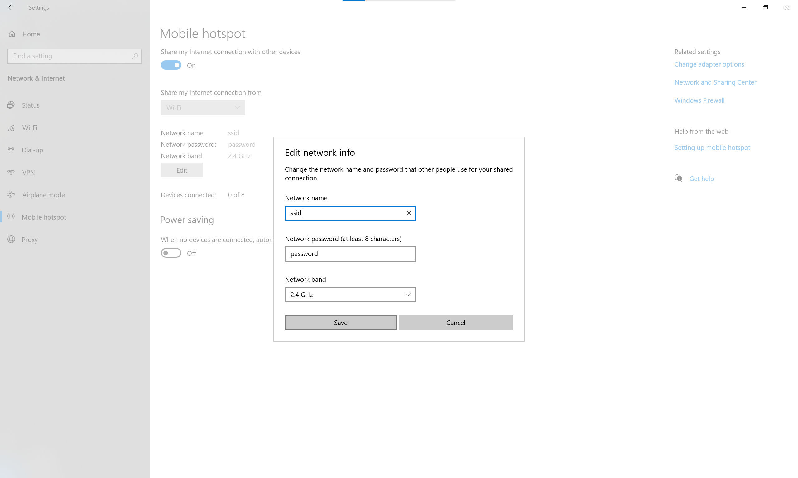

# Hotspot_Configurator

## Description:
Little code to create a Mobile hotspot from Windows using pyautogui. To realize this, the script is opening Microsoft Windows settings page and goes to **Network & Internet** page, to **Mobile Hotspot** section and **Edit**. It fills up the labels with the SSID and PASSWORD stored in the .env file, then activate the network and closes the window. 

In this example the .env file would contains the following lines:   
`SSID = 'ssid'`  
`PASSWORD = 'password'`

The .env file can be stored at the root of the repository.
